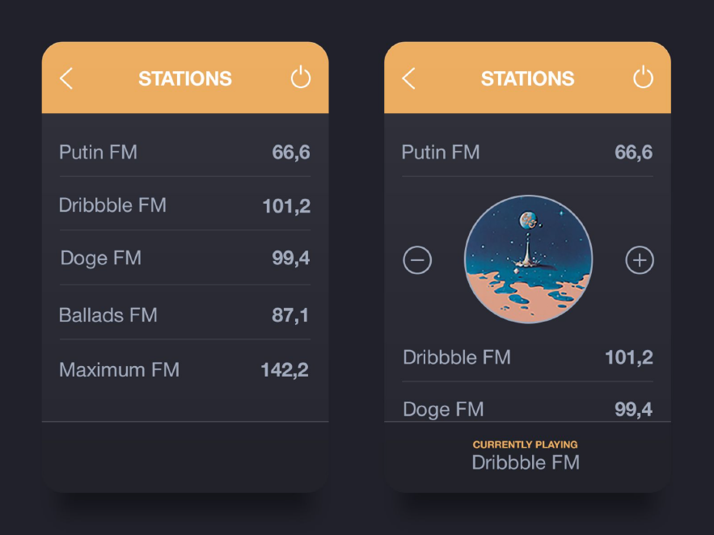

# Le-Wagon-Career-Week-Challenge

## Radio component
Please develop this simple frontend component using the following technologies:
- Javascript
- HTML
- CSS

Radio station data is fetched from this API: https://teclead.de/recruiting/radios
Use Codesandbox (https://codesandbox.io/).

The component must work there and we must be able to check it directly. The design
doesn't have to be 100% exact. Feel free to use icons of your choice (e.g.
https://fontawesome.com/icons?d=gallery)

When you click on a radio station, the right view should then be displayed. You are
welcome to incorporate your own idea.

